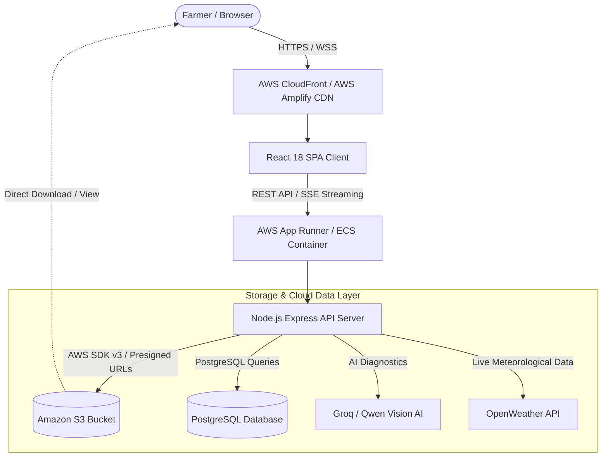

# IntelliFarm AI - Cloud & AWS System Architecture

This document provides a technical walkthrough of how **IntelliFarm AI** leverages **React.js**, **Node.js**, and **Amazon Web Services (AWS)** for high-availability agricultural intelligence, secure storage, and scalable cloud performance.

---

## 1. High-Level Architecture Overview



---

## 2. Technology Stack & AWS Mapping

| Layer | Technology | AWS Service | Purpose |
| :--- | :--- | :--- | :--- |
| **Frontend** | React 18, Redux Toolkit, Framer Motion | **AWS Amplify** / **Amazon S3 + CloudFront** | Global high-speed CDN delivery of the SPA |
| **Backend API** | Node.js, Express, ES Modules | **AWS App Runner** / **AWS ECS (Fargate)** | Auto-scaling containerized REST API with SSE streaming |
| **Media & Object Storage** | `@aws-sdk/client-s3`, `@aws-sdk/s3-request-presigner` | **Amazon S3 (`intellifarm-storage`)** | Storing crop leaf pathology scans, soil test reports, and profile avatars |
| **Security & IAM** | JWT, Helmet HSTS, Rate Limiters | **AWS IAM & AWS Secrets Manager** | Role-based least privilege credentials and secure API token management |
| **Database** | Supabase PostgreSQL / Amazon RDS | **PostgreSQL (AWS RDS compatible)** | Relational farmer accounts, farm profiles, and disease report archives |

---

## 3. Key AWS S3 Implementations in Code

### A. AWS SDK v3 Client Configuration (`server/config/aws.js`)
Configured with AWS SDK v3 modular architecture for lightweight container startup and automatic IAM / Environment credential resolution:
```javascript
import { S3Client } from "@aws-sdk/client-s3";

export const s3Client = new S3Client({
  region: process.env.AWS_REGION || "ap-south-1",
  ...(process.env.AWS_ACCESS_KEY_ID && {
    credentials: {
      accessKeyId: process.env.AWS_ACCESS_KEY_ID,
      secretAccessKey: process.env.AWS_SECRET_ACCESS_KEY,
    }
  })
});
```

### B. Plant Pathology S3 Image Pipeline (`server/services/s3Service.js`)
1. Leaf photos uploaded from the browser are validated for image headers and file size (<5MB).
2. The Node.js service streams the buffer to Amazon S3 with unique SHA-salted keys under `disease-scans/{userId}/...`.
3. The resulting Amazon S3 URL is stored with the pathology diagnosis in the database.

### C. Pre-Signed Upload URLs (`POST /api/aws/s3/presigned-url`)
Supports direct client-to-S3 uploads with time-limited pre-signed PUT URLs, eliminating backend memory bottlenecks for large agricultural files.

---

## 4. How to Deploy to AWS in 10 Minutes

### Option 1: Full-Stack on AWS App Runner (Recommended)
1. Push your repository to GitHub.
2. In the AWS Console, open **AWS App Runner** → **Create Service**.
3. Select **Source code repository** → Choose your GitHub repo.
4. Set Build Provider to **Dockerfile** (uses the root `Dockerfile`).
5. Set Port to `5001`.
6. Under Environment Variables, add:
   - `AWS_REGION=ap-south-1`
   - `AWS_S3_BUCKET_NAME=intellifarm-storage`
   - `AWS_ACCESS_KEY_ID=...`
   - `AWS_SECRET_ACCESS_KEY=...`
   - `SUPABASE_URL=...`
   - `SUPABASE_SERVICE_ROLE_KEY=...`
7. Click **Deploy**. App Runner will output your live HTTPS URL.

### Option 2: Frontend on AWS Amplify + Backend on AWS App Runner / EC2
1. Open **AWS Amplify Console** → **Host web app**.
2. Connect your GitHub repository and select the `main` branch.
3. Amplify will automatically detect `amplify.yml`.
4. Add environment variable: `REACT_APP_SERVER_ENDPOINT=https://your-backend-api.com`
5. Click **Save and Deploy**.

---

## 5. Interview Q&A Cheat Sheet

**Q: Why did you choose Amazon S3 instead of local disk storage?**
> *"Amazon S3 provides 99.999999999% (11 9's) data durability, automatic replication across multiple availability zones, and zero maintenance overhead. In a production agriculture app where farmers upload critical disease scans and soil reports, local server storage would introduce single-point-of-failure risks and limit horizontal scaling across container replicas."*

**Q: How do you handle AWS security and credentials?**
> *"We follow the principle of least privilege. In local/staging environments, credentials are fed via secure environment variables. When deployed to AWS App Runner or ECS, the application uses AWS IAM Instance/Task Roles, eliminating the need to store hardcoded API keys in code."*

**Q: How do you optimize costs and performance for S3 file deliveries?**
> *"We configure Amazon CloudFront CDN in front of S3 to cache images at edge locations globally, reducing S3 GET request costs and delivering sub-50ms image load times for farmers in rural network conditions."*
